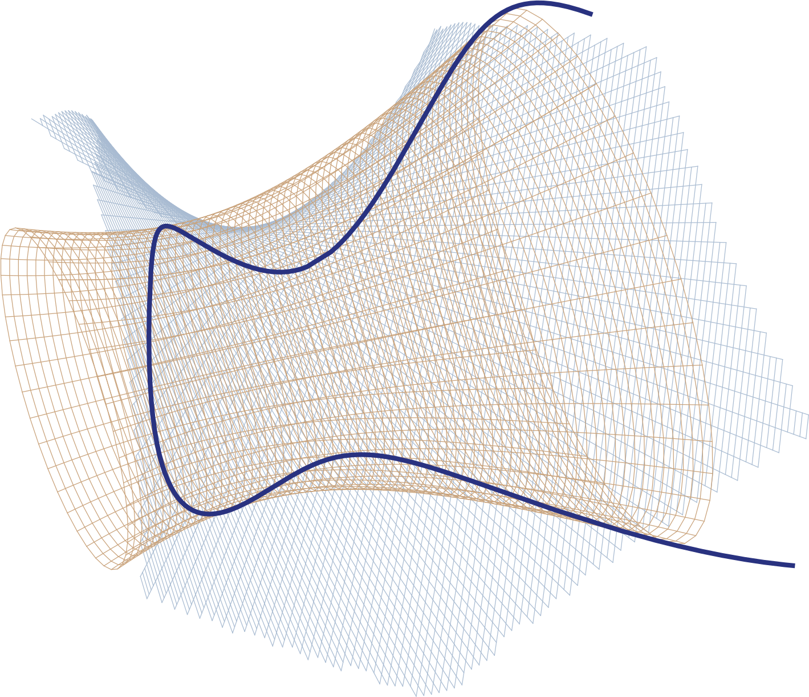

# Quadrics for Manifold Learning in Feature Space

<div>
  
  
  
</div>

This repository contains a PyTorch-based implementation of the algorithms and examples from the paper [Quadric Hypersurface Intersection for Manifold Learning in Feature Space](https://arxiv.org/abs/2102.06186).

## Requirements

You will need Python 3.6+ and the following packages:

- `numpy`
- `pytorch 1.7`
- `sklearn 0.24.2` if you need kernel models
- `matplotlib` for plotting in the .ipynb example notebooks
- `tqdm`
- `scipy` for the `toy_example.ipynb` notebook
- `pandas` for tables


## Quadric Models

The folder named `quadrics` contains an implementation of quadric intersection manifold:

- `model.py` is the implementation of quadrics as `torch.nn.Module`,
- `quadrics.py` is a wrapper with `sklearn`-like interface (including trainer implementation).

## Examples

The folder named `examples` contains Jupyter notebooks with the following examples.

- `toy_example.ipynb`: approximating the seam line of a tennis ball using an intersection of two quadrics.
- `similarity_robustification.ipynb`: demonstration and comparison of different similarity robustification methods.
- `outlier_detection.ipynb`: demonstration and comparison of different outlier detection methods.

## Data
To download the precomputed ArcFace embeddings follow [this link](https://drive.google.com/file/d/1o7uUkkbIvHKEMSAcQV9rs9L0HUkY7dsh/view?usp=sharing).
Put the downloaded file into the project folder.
The archive contains the embeedings generated by ArcFace for the given datasets:

- `MS1M-ArcFace`
- `megaface`
- `cplfw`
- `calfw`
- `flickr`
- `cplfw outliers and anime faces`

Here is the link for [image datasets](https://github.com/deepinsight/insightface/tree/master/recognition/_datasets_).

Apart from the standard datasets we used a new hand-crafted embedding dataset `cplfw and anime outliers`.
It was constructed by selecting (manually) the outliers from CPLFW (they can be found in `labels/cplfw_outliers_labels.json`, notation corresponds to `labels/cplfw_labels_full.txt`) and mixing them with [anime-face-dataset](https://github.com/bchao1/Anime-Face-Dataset).

Pre-trained quadric models (with parameters from `config.json`) may be downloaded [here](https://drive.google.com/file/d/1Ozlh6QAPyyhUdKMyww4cdDy54dBCab7u/view?usp=sharing). 

To extract the archive and to prepare the folders for the models and features calculation execute .sh file:

- `./prepare_folders.sh`


## Scripts

Use `create_models.py` script to fit the manifolds. With default parameters it will fit `OneClassSVM` and `PCA`.

For fitting `quadrics` with the second order distance use the following command:
```
python create_models.py --methods quadrics
```

For fitting `quadrics` with the algebraic distance use the following command:
```
python create_models.py --methods quadrics_algebraic
```

**Warning:** quadrics fitting requires a lot of time! Fitting an intersection of 100 quadrics took us 72 hours on a pair of Quadro RTX 8000 GPUs.

## Citation
```
@article{pavutnitskiy2021quadric,
  title={Quadric Hypersurface Intersection for Manifold Learning in Feature Space},
  author={Pavutnitskiy, Fedor and Ivanov, Sergei O and Abramov, Evgeny and Borovitskiy, Viacheslav and Klochkov, Artem and Vialov, Viktor and Zaikovskii, Anatolii and Petiushko, Aleksandr},
  booktitle={International Conference on Artificial Intelligence and Statistics},
  year={2022},
  organization={PMLR}
}
```
